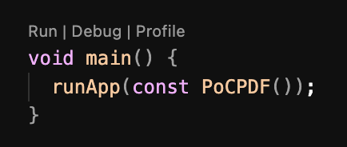

# PoC Internacionalização

Projeto criado exclusivamente para teste de criação de PDFs.

Plataformas testadas:

- [x] Android
- [x] Web
- [ ] Windows

## Inicialização

### Instalar as dependências

```
$ flutter pub get
```

### Executar o projeto

#### Caso esteja executando fora do Visual Studio Code

```
flutter devices
```

Esse comando retorna todos os dispositivos conectados e compatíveis com projetos Flutter.

O retorno possui a estrutura:

`device_name • device_code • device_arch • device_os_version`

Exemplo:

`macOS (desktop) • macos • darwin-arm64 • macOS 14.6.1 23G93 darwin-arm64`

Após obter os dispositivos conectados, execute o comando abaixo passando o device_code que deseja.

```
flutter run --debug -d device_code
```

Exemplo:

`flutter run --debug -d windows`

#### Caso esteja executando dentro do Visual Studio Code

Instale a extensão [Flutter](https://marketplace.visualstudio.com/items?itemName=Dart-Code.flutter) e a habilite.

Com a extensão habilitada, no canto inferior direito do VS Code aparecerá um botão com o dispositivo selecionado para execução do projeto. Conforme o print abaixo.


Caso não seja o dispositivo que deseja executar o projeto, basta clicar nele que aparecerá na barra de comandos do VS Code, no meio superior, todos os dispositivos reconhecidos conectados à sua máquina pela extensão do Flutter.

Após instalada a extensão, no arquivo [main.dart](lib/main.dart), na função `void main()`, você encontrará as ações como no print abaixo. Clique em **Debug**



#### Caso deseje executar a versão web do projeto

O Flutter é compatível (a nível de debug) com o Chrome e seus derivados (baseados em Chromium), mas em alguns casos esses derivados não são reconhecidos pela extensão do Flutter no VS Code e nem pelo comando `flutter devices`. Caso isso aconteça com você, a forma de executar o projeto é executando o comando:

```
flutter run --debug -d web-server
```

Esse comando inicia a versão web do projeto independente do navegador, instanciando-a em uma porta aberta da máquina.

Exemplo de resposta:


## Explicando o código

Para a internacionalização do código são necessárias 2 dependências:

- [flutter_localizations](https://pub.dev/packages/flutter_localizations)
    - Que gerencia toda a parte de arquivos e contextos de localização
- [intl](https://pub.dev/packages/intl)
    - Para obter o idioma selecionado no dispositivo

### Configuração do flutter_localizations

O `flutter_localizations` funciona como um grande arquivo gerado automaticamente a partir dos arquivos de texto traduzidos. A partir desse arquivo gerado, o texto é carregado na interface a partir do idioma atual do dispositivo, em tempo de execução. Caso o idioma do dispostivo seja alterado durante a execução do aplicativo ou o idioma seja alterando dentro do próprio aplicativo (via uma interface de configurações específicias do aplicativo), todos os textos do aplicativo serão alterados.

Para que o arquivo de idiomas seja gerado corretamente, foi inserido no arquivo [pubspec.yaml](./pubspec.yaml) o item `generate: true`.

Na raíz do projeto foi criado um arquivo chamada [l10n.yaml](./l10n.yaml) composto por:

```yaml
arb-dir: lib/l10n # Pasta em que se localizam os arquivos de texto traduzidos
template-arb-file: app_en.arb # O idioma default
output-localization-file: app_localizations.dart # O nome do arquivo final gerado com todos os idiomas
```

#### Internacionalizando os textos

Dentro da pasta `l10n` foram criados 3 arquivos: [app_en.arb](lib/l10n/app_en.arb), [app_es.arb](lib/l10n/app_es.arb) e [app_pt.arb](lib/l10n/app_pt.arb) para Inglês, Espanhol e Português, respecitvamente.

Cada arquivo possui a mesma estrutura e deve conter todas as chaves para que não haja inconsistência na interface.

Nesse exemplo usamos somente a chave `helloWorld` que foi traduzido para os idiomas selecionados para o teste.

#### Utilização

No arquivo [main.dart](lib/main.dart) configuramos o `localizations` com as linhas:

```dart
localizationsDelegates: [
    AppLocalizations.delegate, // Nossos textos
    GlobalMaterialLocalizations.delegate, // Textos do Material (Android)
    GlobalWidgetsLocalizations.delegate, // Textos genéricos
    GlobalCupertinoLocalizations.delegate, // Textos do Cupertino (iOS)
],
// Idiomas suportados
supportedLocales: [
    Locale('en'),
    Locale('es'),
    Locale('pt'),
],
```

No arquivo [home_page.dart](/lib/home_page.dart) importamos nossos textos: `import 'package:flutter_gen/gen_l10n/app_localizations.dart';` e no `Text` usamos da seguinte forma:

```dart
Text(AppLocalizations.of(context)!.helloWorld) // Sendo helloWorld a chave definida nos arquivos de idiomA
```

#### Quando houver novos textos

Sempre que uma chave é criada ou atualizada deve-se rodar o comando `flutter pub get` para atualizar o arquivo gerado.
